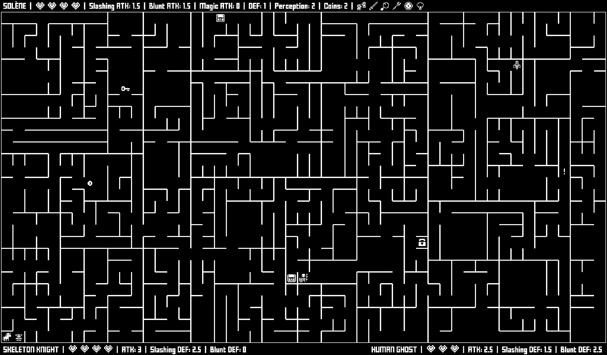
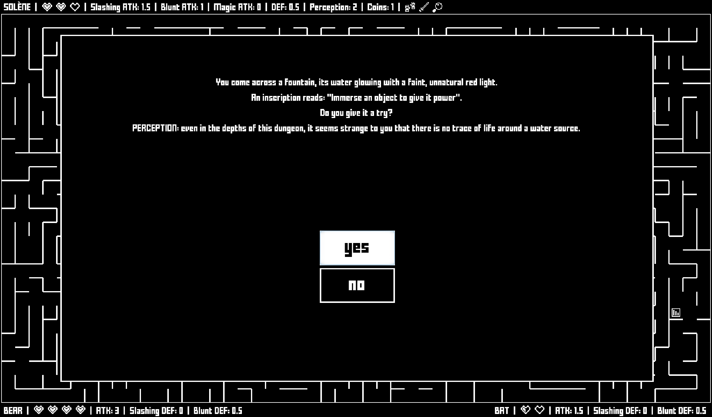

# rogue-maze

A simple video game I made with Godot 3 to avoid having to print the mazes generated with [mazes-scala](https://github.com/jGonzalezFernandez/mazes-scala). It should give you about 20 minutes of fun... if you like mazes.

You can download it from the releases folder.

Some screenshots:

I found GDScript a very easy language to learn, but maybe too easy: it has inheritance but no traits or interfaces, so the only way to reuse code is to extend classes, which complicated the final design of the project.

On the bright side, there are many possible workflows, so it's easy to find one you're comfortable with. For instance, I didn't like how the GUI works, so in the end I did everything by code (only scripts, no scenes).

## Credits

**Textures** (slightly modified):

https://www.kenney.nl/assets/bit-pack (CC0 1.0): most of the characters, inventory items...

Also, a bit of:

https://kz.itch.io/1-bit-fantasy-items by kcaze (CC BY 4.0): the chainmail.

Finally, some things (like that ugly carnivorous plant, or the coins) were drawn by me.

**Music and sound effects**:

https://www.zapsplat.com (standard license with gold account, no attribution required): Ghosts Walk Here, Hallowdream, Maelstrom...

https://freepd.com (CC0 1.0): Creepy Hallow, Asking Questions and Nightmare.

Jordan Irwin (CC0 1.0): thwack.

**Font**: https://www.1001fonts.com/fff-forward-font.html by Fonts For Flash (free for personal and commercial use).
